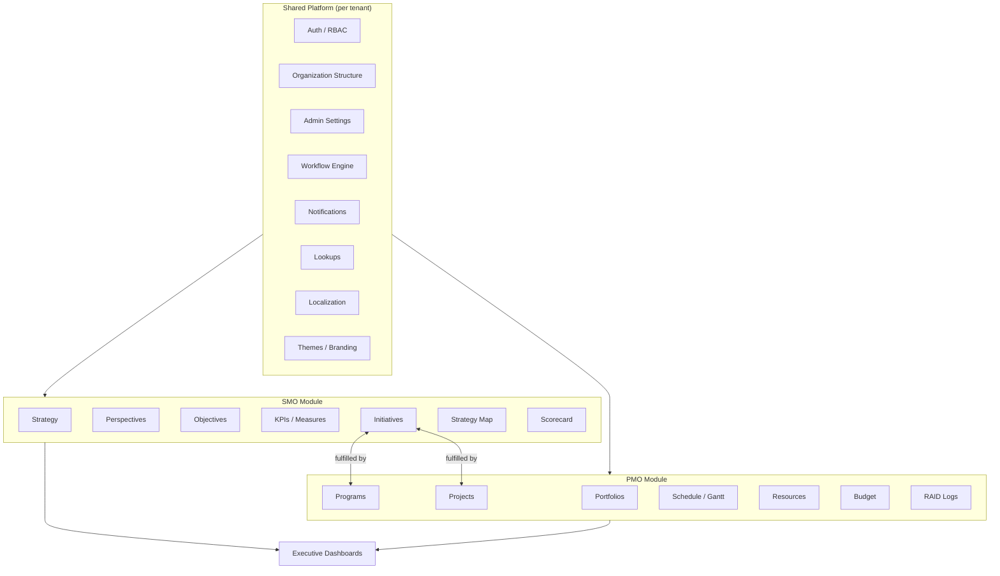
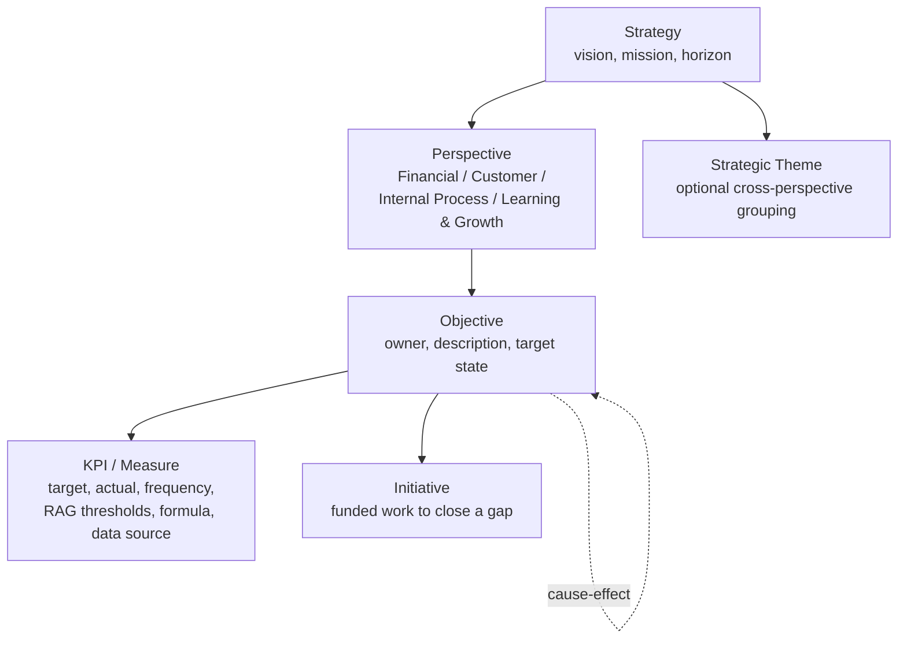
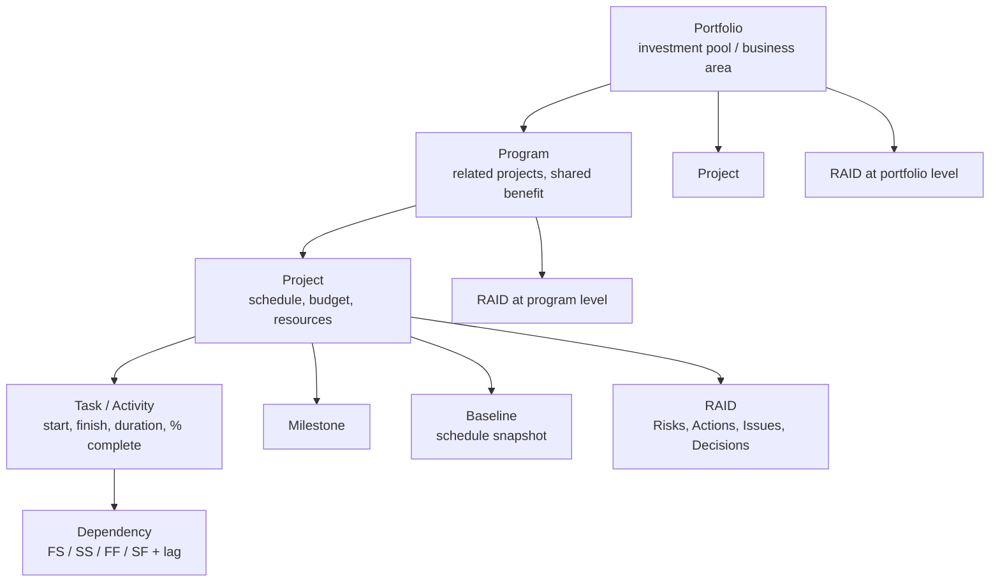
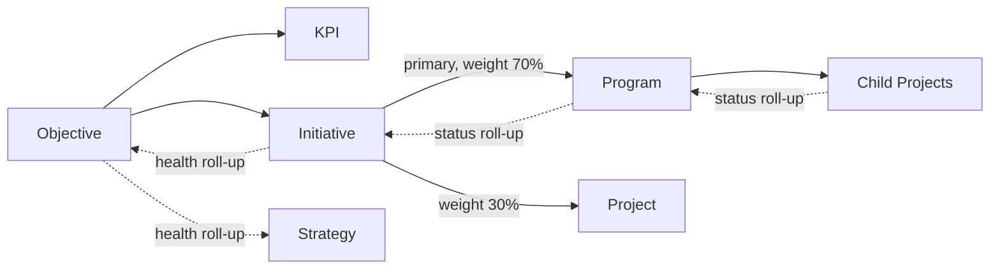
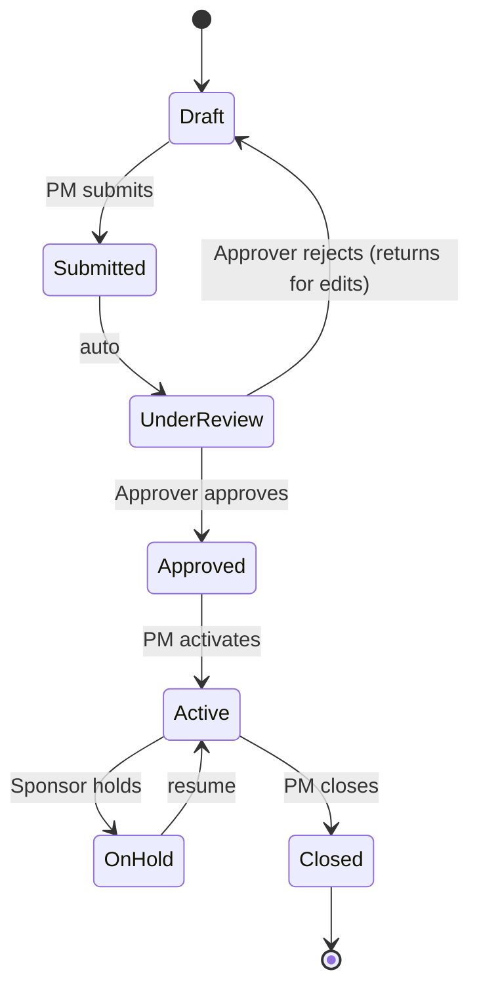

# Product Requirements Document
# Integrated Strategy-to-Execution Platform (SMO + PMO)

**Version:** 1.0 (Draft)
**Product type:** Multi-tenant B2B SaaS
**One-line description:** A single platform where organizations define strategy (SMO) and execute it through portfolios, programs, and projects (PMO), with a live, bidirectional link between the two.

---

## 1. Overview & Vision

Most organizations are good at *writing* strategy and good at *running* projects — but the two live in separate tools and separate teams. Strategy sits in slide decks and spreadsheets; execution sits in project tools. Nobody can answer, in real time, *"Is our day-to-day work actually moving our strategy?"*

This product closes that gap in one web platform with two connected modules:

- **SMO (Strategic Management Office)** — define strategy using the Balanced Scorecard, cascade it into objectives, measure it with KPIs, and fund it through initiatives.
- **PMO (Project Management Office)** — deliver that work through portfolios, programs, and fully-scheduled projects (Gantt, dependencies, critical path, baselines), governed by RAID logs and approval workflows.

The **integration layer** is the differentiator: strategic initiatives are *fulfilled by* PMO programs/projects, execution status rolls **up** into strategy health, and strategic priority flows **down** into funded work.

### 1.1 The wedge (why this wins)
The market splits into two camps:
- **Strategy/BSC tools** (ClearPoint, Cascade, Spider Impact) — strong on scorecards, weak on real project scheduling.
- **PPM tools** (Planview, ServiceNow SPM, Clarity, Sciforma, Smartsheet) — strong on execution, weak on strategy measurement.

Very few do *both* well with genuine bidirectional linkage. That link is the product.

---

## 2. Target Users & Personas

| Persona | Module | What they need |
|---|---|---|
| **Executive / Sponsor** | Both | A single dashboard: is strategy on track, where's the risk, are we funding the right work? Read-mostly. |
| **Strategy Owner / SMO Lead** | SMO | Build the strategy map, own objectives & KPIs, run strategy reviews, decide which initiatives get funded. |
| **Portfolio Manager** | PMO | Balance investment across programs/projects, manage capacity, report portfolio health. |
| **Program Manager** | PMO | Coordinate related projects, manage cross-project dependencies and benefits, program-level RAID. |
| **Project Manager** | PMO | Build and manage the schedule (Gantt), assign resources, track budget, run status reports, project RAID. |
| **Objective / KPI Owner** | SMO | Keep a specific KPI's actuals updated, explain variance, own the objective's health. |
| **Team Member / Contributor** | PMO | See assigned tasks, update progress, log issues. |
| **Tenant Admin** | Platform | Configure the tenant: users/roles, org structure, workflows, lookups, localization, branding. |
| **Super Admin (vendor)** | Platform | Manage tenants, subscriptions, platform-wide config. |

---

## 3. Product Principles

1. **Strategy and execution are one graph, not two apps bolted together.** Every project should be traceable up to an objective; every objective should be traceable down to funded work.
2. **Configurable, not hard-coded.** Because it's sold to many companies, workflows, lookups, org structures, terminology, and branding are per-tenant configuration.
3. **Governance without friction.** Approvals and RAID are built in, but never block the fast path more than the customer chose to.
4. **Bilingual and RTL from day one.** Arabic + English at minimum, full right-to-left layout support.
5. **Roll-up is automatic.** Status/health at any level is computed from its children, not manually retyped.

---

## 4. Information Architecture

One platform, one login, one org/user model, one admin. Two functional modules the user switches between, plus a shared executive layer.

---

## 5. Domain Model

### 5.1 SMO entities

- **Strategy** — root per org unit; vision, mission, time horizon (e.g. 2025–2028).
- **Perspective** — the 4 Balanced Scorecard perspectives (configurable, tenant can rename/reorder): Financial, Customer, Internal Process, Learning & Growth.
- **Strategic Theme** *(optional)* — a value-creation storyline that cuts across perspectives (e.g. "Operational Excellence").
- **Objective** — a strategic goal within a perspective, with an owner and cause-effect links to other objectives (this produces the strategy map).
- **KPI / Measure** — the quantified proof an objective is working. Fields: target, actual, unit, frequency (monthly/quarterly), direction (higher/lower is better), RAG thresholds, formula, data source, owner, historical series.
- **Initiative** — a discrete, funded effort to move one or more KPIs / close an objective gap. **This is the bridge to PMO.** Fields: budget, sponsor, expected benefit, status, and links to Programs/Projects.

### 5.2 PMO entities

- **Portfolio** — a collection of programs/projects grouped by business area or funding pool; the level where investment is balanced.
- **Program** — related projects managed together for a shared benefit; owns cross-project dependencies and program-level RAID.
- **Project** — the unit of scheduled work. Owns schedule, tasks, resources, budget, RAID, status reports.
- **Task / Activity** — Gantt row: start, finish, duration, % complete, assignee, WBS code, effort.
- **Dependency** — Finish-to-Start, Start-to-Start, Finish-to-Finish, Start-to-Finish, with lead/lag.
- **Milestone** — zero-duration checkpoint.
- **Baseline** — a saved snapshot of the schedule/budget for planned-vs-actual variance.
- **RAID log** — Risks, Actions, Issues, Decisions (you called these risks/issues/actions/escalations — "escalations" maps to Decisions or a separate escalation flag). Present at project, program, and portfolio level.

### 5.3 Integration layer — the crown jewel

**Recommended model: many-to-many with a primary link + contribution weight.**

- One **Initiative** can be fulfilled by **many** Programs/Projects; one Project can contribute to **many** Initiatives.
- A `primary` flag marks the main delivery vehicle; `contribution_weight` lets roll-up math attribute execution health proportionally.
- **Roll-up (execution → strategy):** project % complete + RAID severity + schedule variance → initiative delivery health → objective health → strategy health.
- **Roll-down (strategy → execution):** an objective's priority and its gap-to-target inform initiative funding decisions and project prioritization.

---

## 6. Feature Specifications

### 6.1 SMO Module

**6.1.1 Strategy setup**
Create a strategy per organization/org-unit with vision, mission, and time horizon. Support multiple strategies (e.g. corporate + divisional) with parent-child cascade.

**6.1.2 Perspectives & themes**
Ship the 4 BSC perspectives as defaults; allow tenant to rename, reorder, add, or hide. Optional strategic themes that group objectives across perspectives.

**6.1.3 Objectives**
CRUD objectives under a perspective; assign owner; set target state and time frame; define cause-effect links to other objectives (used by the strategy map).

**6.1.4 KPIs / Measures**
Each objective carries one or more KPIs with: target, actual, unit, direction, frequency, RAG thresholds, formula (support calculated KPIs from other KPIs), data source, owner. Manual entry now; automated data feeds (API/import) later. Full historical time series with trend charts.

**6.1.5 Initiatives**
Create initiatives against objectives; capture budget, sponsor, expected benefit, timeline, status. Link to PMO Programs/Projects (M:N, primary + weight). Initiative status is derived from its linked execution work.

**6.1.6 Strategy Map**
Visual canvas: objectives laid out by perspective (rows), with cause-effect arrows between them. Color = current RAG health. Click through to objective → KPIs → initiatives → projects.

**6.1.7 Scorecard**
Tabular/dashboard view of objectives and KPIs with RAG status, target vs actual, trend sparkline, and owner. Filter by perspective, theme, org unit, period. This is the artifact used in strategy review meetings.

**6.1.8 Strategy reviews**
Ability to snapshot a scorecard at a point in time and attach review notes / decisions (feeds the RAID/Decisions log).

### 6.2 PMO Module

**6.2.1 Portfolio management**
Create portfolios; group programs and projects; portfolio-level dashboard (total budget, spend, health distribution, resource load). Portfolio RAID.

**6.2.2 Program management**
Group related projects; manage shared benefits and cross-project dependencies; program-level Gantt (rolled up from child projects); program RAID and status reports.

**6.2.3 Project scheduling (full Gantt)**
- WBS task hierarchy (parent/summary tasks, subtasks).
- Start/finish/duration with working-calendar awareness (per-tenant calendars, holidays, weekends — note: weekend defaults differ by region; make it configurable, important for Jordan/GCC where the weekend is Fri–Sat).
- **Dependencies**: FS, SS, FF, SF with lead/lag.
- **Critical path** calculation and highlighting.
- **Baselines**: save multiple baselines; show planned-vs-actual variance (schedule and cost).
- Milestones, % complete, progress bars, drag-to-reschedule.
- **Import from MS Project (.mpp)** and export (.mpp / .xlsx / PDF).

**6.2.4 Resource management**
Resource pool (people, roles, capacity); assign to tasks; allocation %; capacity vs demand view; over-allocation warnings. (Depth increases by phase.)

**6.2.5 Budget & cost**
Planned vs actual cost at task/project/program/portfolio level; optional Earned Value Management (PV, EV, AC, SPI, CPI) in a later phase.

**6.2.6 RAID logs**
Risks (probability × impact scoring, mitigation, owner), Actions (assignee, due date, status), Issues (severity, resolution), Decisions/Escalations (raised-to, status). Available at project, program, portfolio level with roll-up visibility.

**6.2.7 Status reporting**
Structured periodic status report per project/program (overall RAG, accomplishments, next period, key RAID items, milestone status). Snapshot + history.

### 6.3 Integration features
- Link/unlink initiatives to programs/projects with primary + weight.
- Automatic health roll-up along the graph (project → initiative → objective → strategy).
- Traceability view: from any objective, drill down to the exact projects/tasks delivering it; from any project, trace up to the strategy it serves.
- "Unaligned work" report: projects not linked to any initiative/objective (strategy leakage), and "unfunded objectives" report: objectives with no initiatives.

### 6.4 Executive layer
Cross-module dashboards: strategy health overview, portfolio health, initiative delivery status, top risks across the org, budget burn. Configurable widgets; export to PDF/PowerPoint for board packs.

---

## 7. Platform & Admin

### 7.1 Multi-tenancy
- Tenant = a customer company. Strict data isolation between tenants.
- Recommended: shared-schema with `tenant_id` on every row + row-level security (cost-efficient at scale); offer dedicated schema/DB for enterprise tiers if needed.
- Tenant-level: subscription plan, feature flags, user seats, storage limits.

### 7.2 Organization structure
Per-tenant hierarchical org units (company → division → department → team). Objectives, portfolios, users, and permissions can be scoped to org units. Strategies can cascade along this hierarchy.

### 7.3 Users, roles & permissions (RBAC)
Role-based access with the roles in §2. Permissions are per-entity-type × per-action (view/create/edit/delete/approve) and scopable to org unit. Support custom roles per tenant.

### 7.4 Workflow engine (configurable)
The feature you specifically called out. A per-tenant, admin-configurable **state machine** engine applied to entity types (Project, Program, Initiative, Budget change, etc.).

- **States**: e.g. Project → Draft → Submitted → Under Review → Approved → Active → On Hold → Closed.
- **Transitions**: define who can move an entity from state A to B (by role / specific user / org-unit manager).
- **Approvals**: single or multi-step; sequential or parallel; conditional routing (e.g. budget > X requires an extra approver).
- **Triggers**: entering a state fires notifications and/or actions.
- **Admin UI**: visual workflow builder in admin settings; workflows are versioned; assign a workflow to an entity type per tenant.

### 7.5 Notifications
- Channels: in-app, email, digest (daily/weekly). SMS/push later.
- Event-driven: workflow transitions, approvals pending, task assignments, due/overdue items, KPI breaches, RAID escalations.
- Per-user preferences; per-tenant defaults; templated and localized.

### 7.6 Lookups (reference data)
Admin-managed configurable dropdown/reference lists per tenant: status values, RAID categories, risk scoring scales, priority levels, currencies, cost types, etc. Everything a customer might want to rename or extend without a code change.

### 7.7 Localization
- Multi-language UI (Arabic + English at minimum). Full **RTL** layout for Arabic (mirrored navigation, Gantt, charts, forms).
- Per-user language preference; per-tenant default.
- Localized dates, numbers, currencies, and calendars (Gregorian + Hijri where relevant).
- All user-facing strings and notification templates translatable.

### 7.8 Themes / branding (white-label)
Per-tenant logo, color palette, favicon, and optionally custom domain. Light/dark themes. This matters because it's sold to many companies who want their own look.

### 7.9 Audit & security
- Full audit log (who changed what, when) across entities and admin config.
- SSO/SAML/OIDC, 2FA. Encryption at rest and in transit. Role-scoped API.

### 7.10 Integrations & API
- Import: MS Project (.mpp), Excel/CSV.
- Export: PDF, Excel, PowerPoint, .mpp.
- REST API + webhooks; SSO connectors. Marketplace/connectors in a later phase.

---

## 8. RBAC Matrix (illustrative)

| Capability | Super Admin | Tenant Admin | Strategy Owner | Portfolio Mgr | Program Mgr | Project Mgr | Contributor | Exec/Viewer |
|---|:---:|:---:|:---:|:---:|:---:|:---:|:---:|:---:|
| Manage tenants/billing | ✅ | — | — | — | — | — | — | — |
| Configure workflows/lookups/themes | — | ✅ | — | — | — | — | — | — |
| Manage users & roles | — | ✅ | — | — | — | — | — | — |
| Create/edit strategy & objectives | — | — | ✅ | — | — | — | — | — |
| Update KPI actuals | — | — | ✅ | — | — | — | KPI owner | — |
| Create/fund initiatives | — | — | ✅ | ✅ | — | — | — | — |
| Create/manage portfolios | — | — | — | ✅ | — | — | — | — |
| Create/manage programs | — | — | — | ✅ | ✅ | — | — | — |
| Create/manage projects & schedule | — | — | — | — | ✅ | ✅ | — | — |
| Update task progress | — | — | — | — | ✅ | ✅ | ✅ | — |
| Approve (per workflow) | — | — | scoped | scoped | scoped | scoped | — | — |
| View dashboards | ✅ | ✅ | ✅ | ✅ | ✅ | ✅ | scoped | ✅ |

*(Custom roles per tenant override this baseline.)*

---

## 9. Non-Functional Requirements

- **Tenancy & scale:** isolate tenant data; support thousands of tenants; large projects (10k+ tasks) must render/edit smoothly.
- **Performance:** Gantt and dashboards responsive at scale; roll-up computed incrementally, not on every read.
- **Security & compliance:** RBAC, audit, encryption, SSO/2FA; target SOC 2 readiness.
- **Availability:** 99.9% target; backups and disaster recovery.
- **i18n/RTL:** first-class, not retrofitted.
- **Accessibility:** WCAG 2.1 AA.
- **Auditability:** every state change traceable.

---

## 10. Phased Roadmap

### Phase 1 — MVP (Foundation + Core of both modules)
- Multi-tenant foundation, auth, RBAC, org structure.
- Admin settings: lookups, localization (AR/EN + RTL), themes.
- **Fixed** (not yet configurable) approval flow for project/initiative creation.
- PMO: portfolio/program/project CRUD, lightweight scheduling (tasks + milestones + basic dependencies), RAID, status reports.
- SMO: strategy/perspectives/objectives/KPIs, scorecard, initiatives.
- Basic initiative→project linking + simple roll-up.
- In-app + email notifications.
- Executive dashboard v1.

### Phase 2 — Depth & the differentiators
- **Configurable workflow engine** (visual builder, multi-step approvals).
- **Full Gantt**: critical path, multiple baselines, all dependency types, drag-reschedule, working calendars.
- Resource management + capacity view.
- Budget tracking (+ EVM optional).
- **Strategy map** visual with cause-effect + health color.
- Full bidirectional roll-up/roll-down + traceability & alignment reports.
- MS Project import/export.

### Phase 3 — Scale & intelligence
- Advanced analytics, portfolio scenario/what-if, capacity planning.
- API + webhooks + connector marketplace, SSO/SAML.
- Board-pack export (PDF/PPT), Hijri calendar, automated KPI data feeds.
- Mobile app; AI insights (risk prediction, strategy-alignment suggestions).

---

## 11. Success Metrics

- **Product:** % of projects linked to an initiative/objective (alignment), time-to-configure a new tenant, KPI freshness (% KPIs updated on schedule).
- **Business:** tenants onboarded, seat expansion, churn, activation (tenant reaches a live strategy map + first scheduled project).
- **Value proof:** customers can answer "is our work moving our strategy?" in one screen.

---

## 12. Open Questions / Decisions Still Needed

1. **Tenancy DB strategy** — shared-schema + RLS (default) vs. schema-per-tenant for enterprise tier?
2. **"Escalations"** — model as a flag on Issues, or as its own RAID category (Decisions)? Recommendation: escalation = a state/flag that can apply to Risks or Issues, routed via workflow.
3. **KPI data automation** — manual entry for MVP; which integrations matter first (Excel, API, BI tools)?
4. **Calendar/weekend defaults** — confirm per-region defaults (e.g. Fri–Sat weekend for Jordan/GCC) as tenant config.
5. **Pricing model** — per seat, per tenant tier, or module-based (SMO vs PMO vs bundle)?
6. **Terminology configurability** — do tenants need to rename core objects (e.g. "Initiative" → "Programme")? Common in gov/public sector.

---

*End of PRD v1.0 (Draft). This is a living document — sections 5 (domain model), 7.4 (workflow engine), and 6.2.3 (Gantt) are the areas to spec in most detail before build.*
